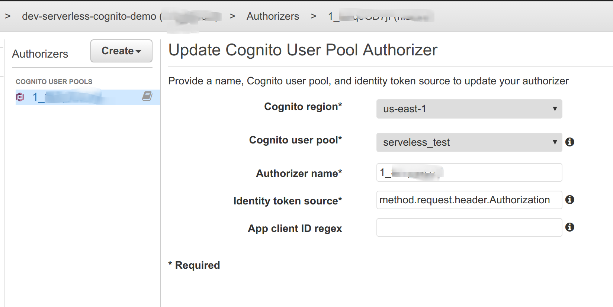
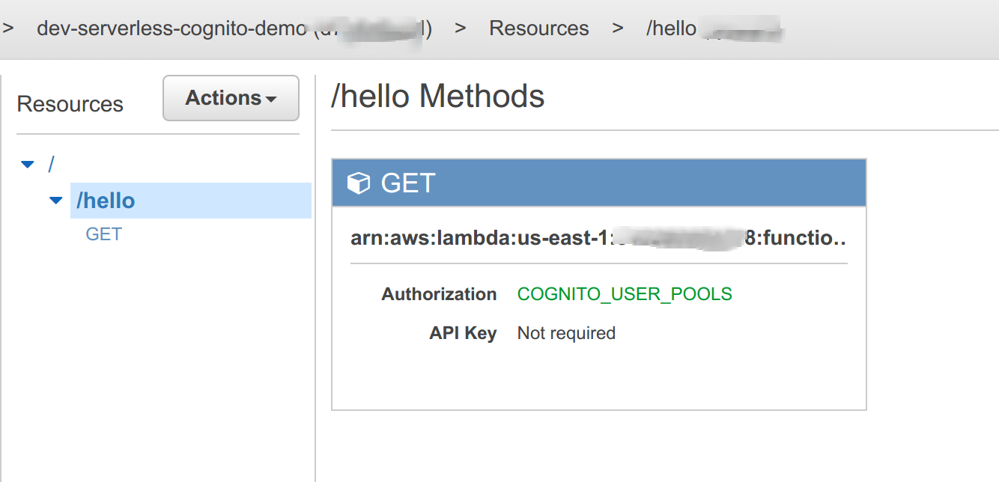

# Serverless Test

This testing assume that you have default AWS credentials set up in ~/.aws or
you are running on an EC2 instance with an EC2 role with the appropriate
permissions.

# Testing

## Create the pool

First you need to create a userpool
```
bin/create_user_pool
```

this will output the ARN
```
User Pool ARN is arn:aws:cognito-idp:us-east-1:123456789:userpool/us-east-1_XXXXXX
```

## Configure Serverless

Copy this ARN into `arn:` section of `serverless.yml`

Configure serverless to use your AWS credential.


## Bring up the stack

```
sls deploy
```

## Verify

* Browse to https://console.aws.amazon.com/apigateway/home?region=us-east-1#/apis
* Click on *dev-serverless-cognito-demo*
* Click on *Authorizers*
* You should see an authorizer configured as per 
* Click on *Resources*
* Click on */hello*
* You should see the method is protected by the cognito pool as per 

